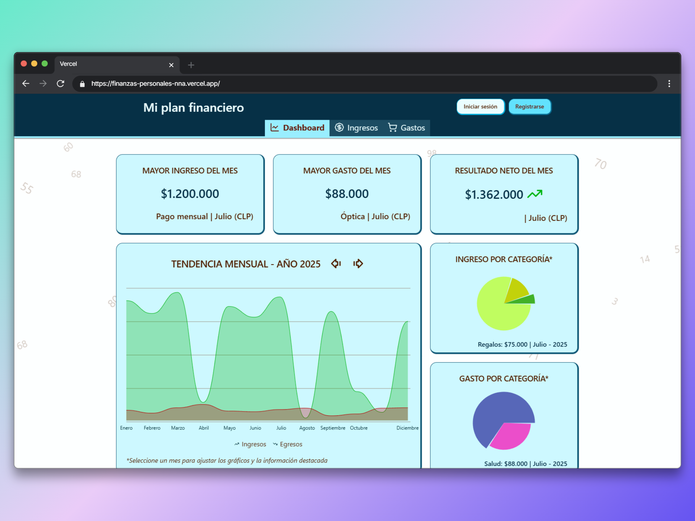
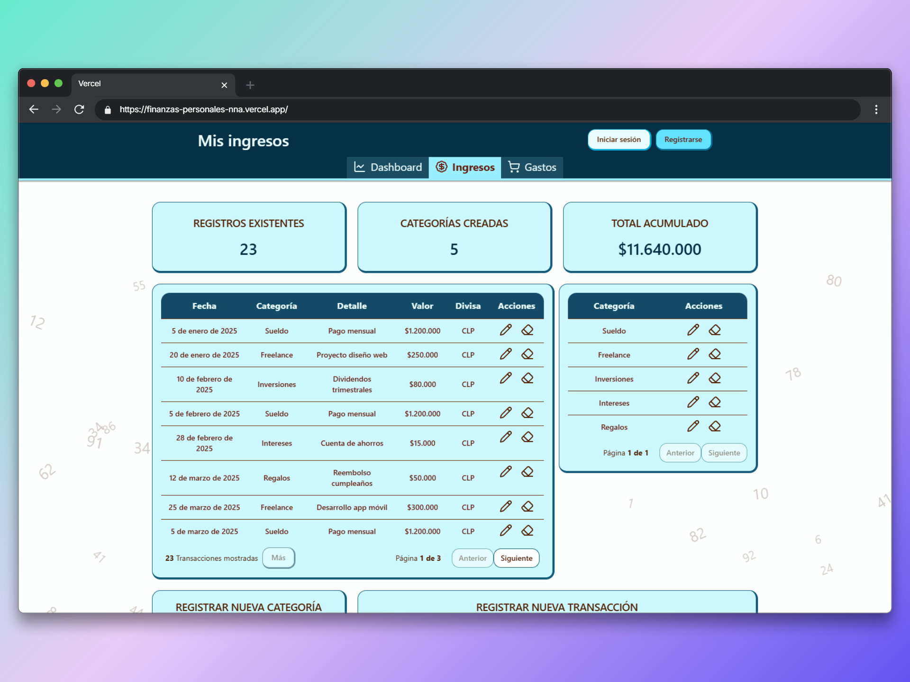
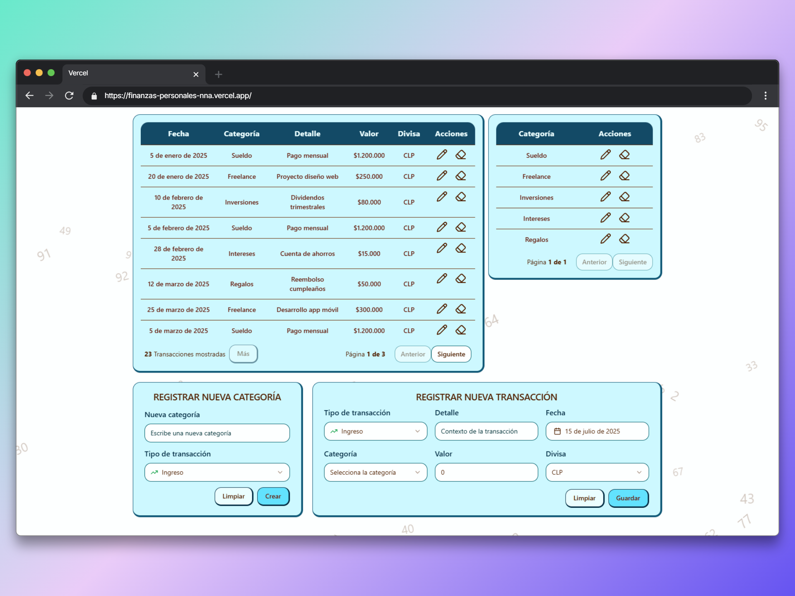
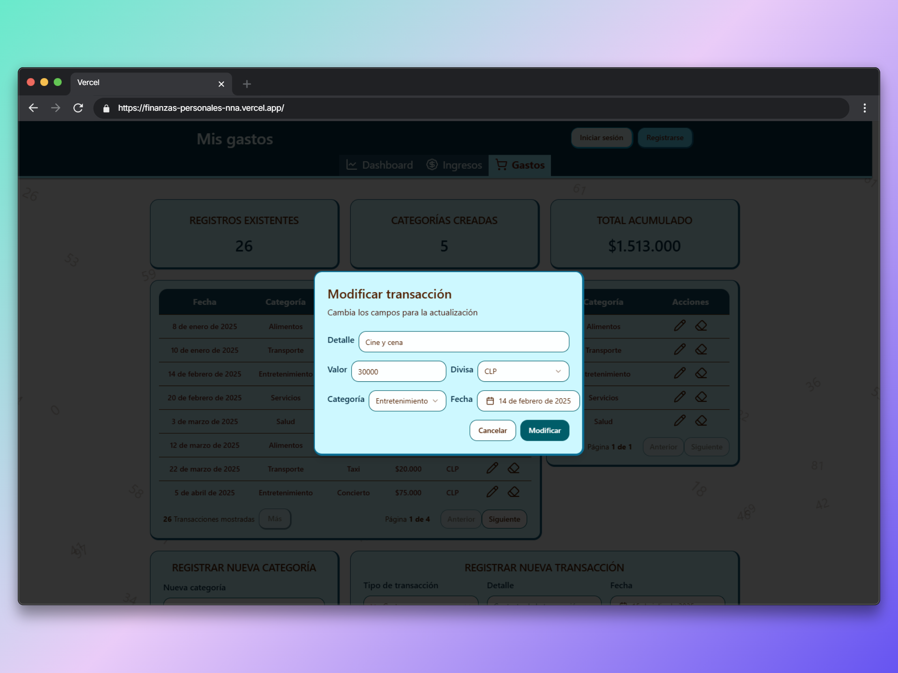

<h1 align="center">
  <a href="#"> Gestor de finanzas personales </a> 
</h1>

<div align="center">
  
</div>

<p align="center">
 <a href="#acerca-de">Acerca de</a> •
 <a href="#caracteristicas">Caracteristicas</a> •
 <a href="#stack-tecnológico">Stack Tecnológico</a> • 
 <a href="#despliegue-local">Despliegue local</a> •
 <a href="#previsualización">Previsualización</a>
</p>

## Acerca de

Aplicación web diseñada para gestionar ingresos y egresos personales con una muestra resumida a través de un dashboard.
Estas transacciones (ingresos/gastos) se almacenan en una base de datos en Firebase al registrarse y acceder con un correo o se almacenan en LocalStorage en caso de no iniciar sesión.

## Caracteristicas

- [x] Almacenamiento de datos en base de datos Firebase o en local.
- [x] Dashboard interactivo con gráficos: Muestra anual, mayores valores por mes y agrupación por categorias mensuales.
- [x] Autenticación con correo electrónico para almacenamiento de datos.
- [x] Diseño responsivo: Contenido ajustable a la vista desde un computador o de un celular.
- [x] Autenticación por JWT y cookies.
 
## Stack Tecnológico

Esta aplicación consta de frontend, backend y conexión con base de datos Firebase:

#### **FrontEnd** (React + Typescript)

Se utiliza componentes de Shadcn/UI y Tailwind CSS para el estilizado de la página. 
Adicionalmente se utiliaz React Router Dom para el manejo de rutas y zustand para el manejo de estado global.

#### **BackEnd** (Express/NodeJS + Express)

En el backend se utiliza Express para la creación de APIs. Adicionalmente se implementa Jest para las pruebas de los endpoints, Swagger para la documentación de la API y la librería de Firebase para la comunicación con la base de datos.

## Despliegue local

### Pre-requisitos

Antes de empezar, necesitas tener las siguientes herramientas instaladas en tu máquina:

- [Git](https://git-scm.com)
- [Node.js](https://nodejs.org/en/) (Probado con la versión v20.12.2)
- Un editor de código, preferiblemente [VSCode](https://code.visualstudio.com/)

### Instalación y ejecución del FrontEnd

```bash
# Clonar este repositorio
$ git clone https://github.com/nicolasnna/web-finanzas-personales.git

# Acceder a la carpeta del proyecto en tu terminal
$ cd web-finanzas-personales

# Acceder a la carpeta del frontend
$ cd frontend
```
Dentro de la carpeta se debe crear un archivo .env para configurar la ruta del backend

```bash
VITE_BACKEND_URL=http://localhost:4000/api # Backend por defecto
```

Por último, se instala las dependencias y se ejecuta:

```bash
# Instalar las dependencias
$ npm install

# Ejecutar la aplicación en modo desarrollo
$ npm run dev

# La aplicación se abrirá en el puerto: 5173 - ir a http://localhost:5173
```

### Instalación y ejecución del BackEnd

```bash
# Clonar este repositorio
$ git clone https://github.com/nicolasnna/web-finanzas-personales.git

# Acceder a la carpeta del proyecto en tu terminal
$ cd web-finanzas-personales

# Acceder a la carpeta del backend
$ cd backend
```
Dentro de la carpeta se debe crear un archivo .env para configurar conexión con la base de datos y al algoritmo de JWT.

```bash
# Base de datos
API_FIREBASE=<TU API_FIREBASE>
AUTH_DOMAIN=<TU AUTH_DOMAIN>
PROJECT_ID=<TU PROJECT_ID>
STORAGE_BUCKET=<TU STORAGE_BUCKET>
MESSAGING_SENDER_ID=<TU MESSAGING_SENDER_ID>
APP_ID=<TU APP_ID>
MEASUREMENT_ID=<TU MEASUREMENT_ID>
# JWT
JWT_SECRET=FINANZA_PERSONAL
JWT_EXPIRE=30m

URL_CORS_PERMIT=http://localhost:5173 # Dirección del frontend
```

> [!note] Requiere crear un proyecto en firebase y configurar la API key con el proyecto.

Por último, se instala las dependencias y se ejecuta:

```bash
# Instalar las dependencias
$ npm install

# Ejecutar la aplicación en modo desarrollo
$ npm run dev

# La aplicación se abrirá en el puerto: 4000 - ir a http://localhost:4000
```

## Previsualización

<div align='center'>
  
  <p>Tabla de ingresos y categorías de ingresos<p>
</div>

<div align='center'>
  
  <p>Formularios de registro de transacción y categoría<p>
</div>

<div align='center'>
  
  <p>Actualización de transacción<p>
</div>

